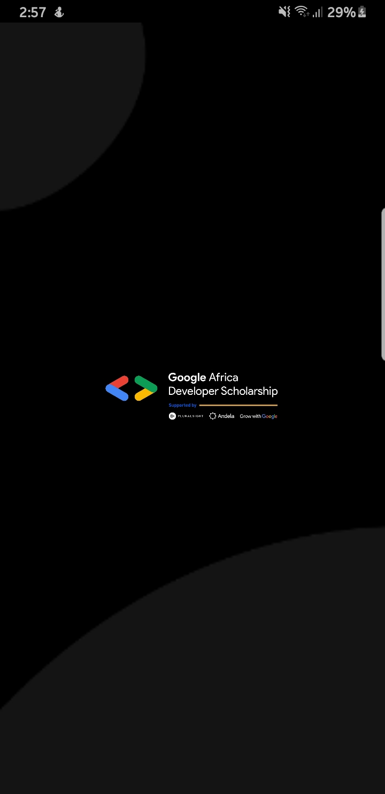
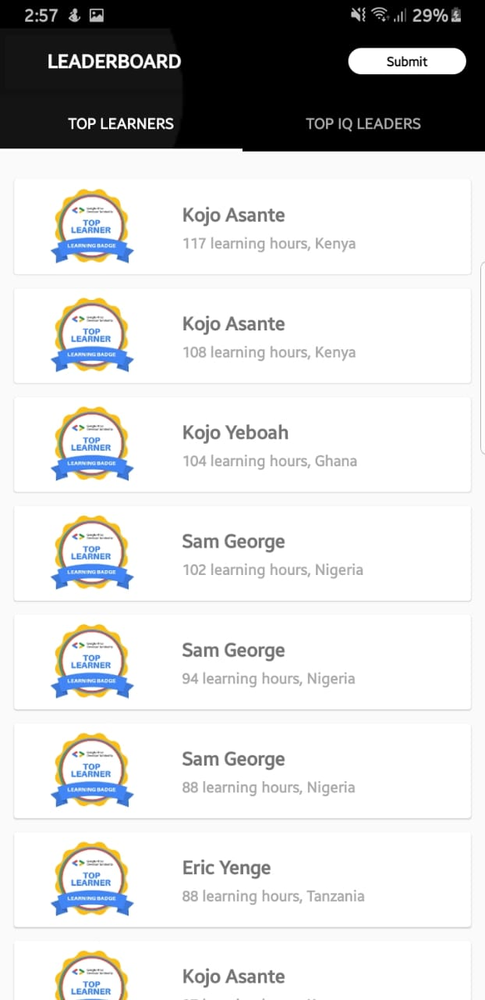
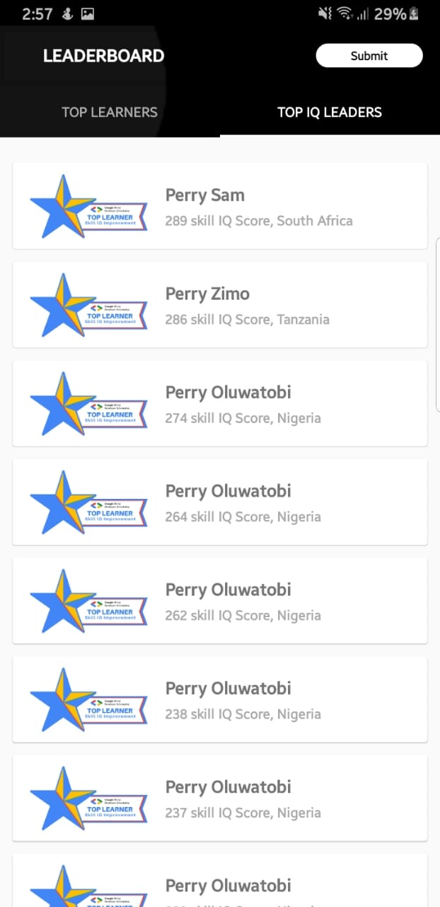
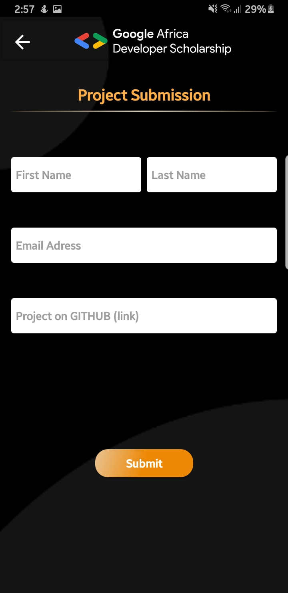
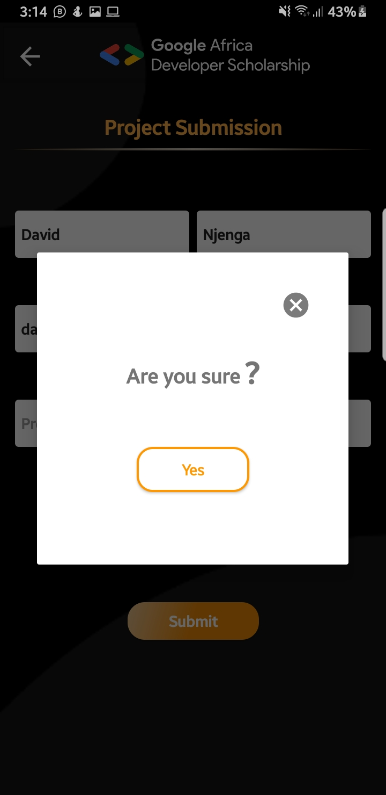
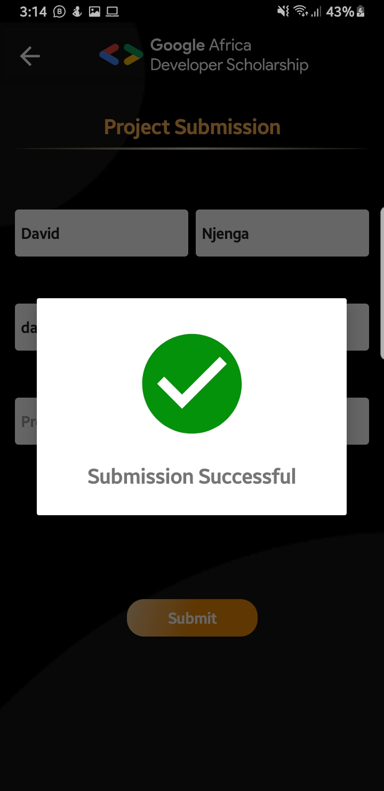
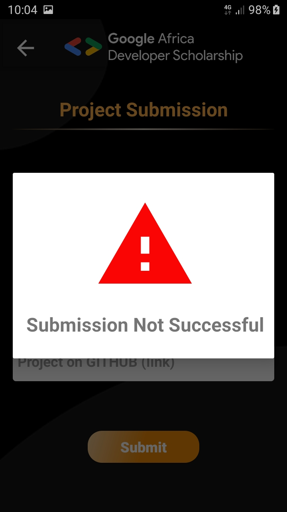

# GADS2020-practice-project
Building a GADS Leaderboard Mobile Application

## Summary

This project is a very simple Android Project aimed at getting to implement some simple concepts that are very important as far as Android Development is concerned. In this project, I am going to implement a mobile design of the GADS 2020 Leaderboard. The mobile App will display Top 20 learners in the Learning Leaders’ category and Top 20 learners in the Skill IQ Leaders’ category.

## Screenshots
<table style="width:100%">
  <tr>
    <td></td>
    <td></td> 
    <td></td>
    <td></td>
  </tr>
  <tr>
    <td></td>
    <td></td>
    <td></td>
  </tr>
</table>
